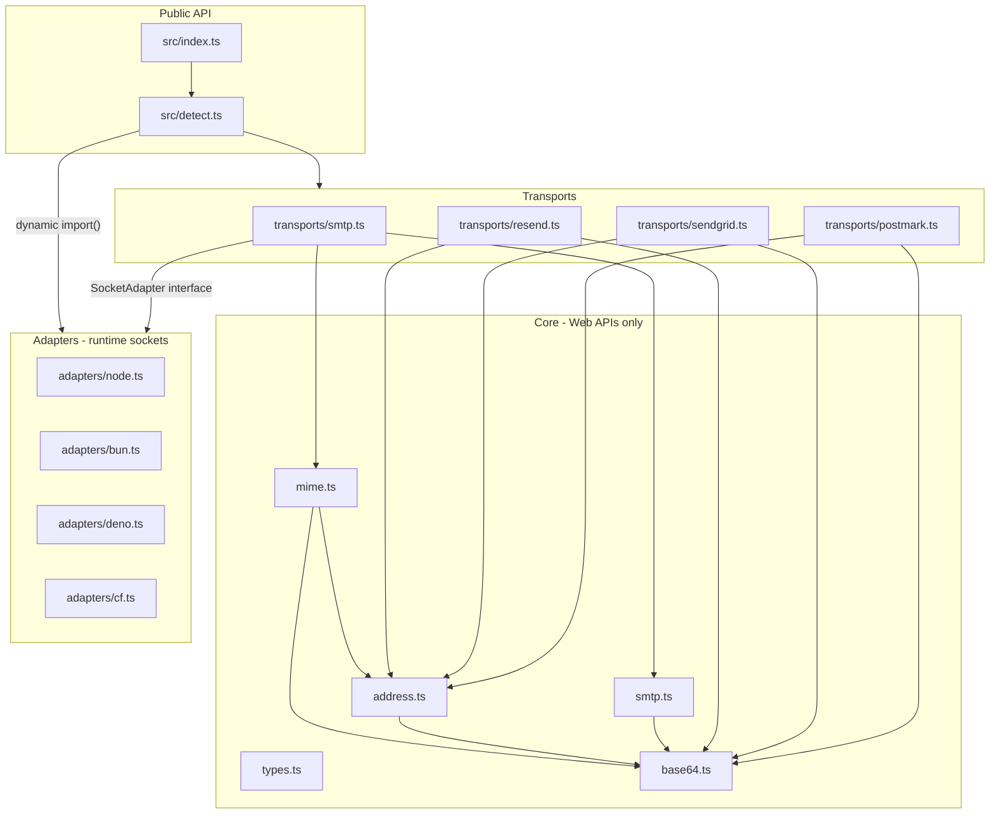

# sendx — Full Library Implementation Plan

## Current State

The repo is a fresh [`bun init`](package.json) scaffold:

| Exists | Missing |
|--------|---------|
| `.gitignore` (partial — needs `*.local`) | `biome.json`, `build.ts` |
| Minimal `package.json` (no exports/scripts) | Full `src/` tree (only placeholder [`src/index.ts`](src/index.ts)) |
| Bun-default `tsconfig.json` | `tests/`, `tools/mcp/` |
| `bun.lock`, `node_modules` | All library logic |

**Unit 1 will replace** `package.json`, `tsconfig.json`, and `src/index.ts` content, and add missing config/files.

---

## Architecture Overview



**Dependency rule (never violate):**
- `src/core/*`: **zero** `node:`, `Bun.`, `Deno.` imports (no static or dynamic)
- Transports: `node:fs/promises` and `node:dns/promises` allowed **only via dynamic `import()`** for `attachment.path` resolution and MX lookup — never static imports
- Adapters: runtime-specific only, marked `external` in [`build.ts`](build.ts)
- [`src/detect.ts`](src/detect.ts): dynamic `import()` for adapters only — no static adapter imports
- [`src/index.ts`](src/index.ts): re-exports only, no logic

---

## Execution Plan (15 Units)

### Unit 1 — Project Setup

**Replace/create:**

- [`package.json`](package.json) — exact spec: `sideEffects: false`, subpath `exports`, scripts (`build`, `test`, `lint`, `format`, `typecheck`, `mcp`), devDeps `@biomejs/biome` + `typescript`
- [`tsconfig.json`](tsconfig.json) — spec config: `target: ES2022`, `exactOptionalPropertyTypes: true`, `rootDir: ./src`, `outDir: ./dist`, `include: ["src"]`, exclude tests/tools
- [`biome.json`](biome.json) — spec config
- [`build.ts`](build.ts) — Bun multi-entry build with `splitting: true`, externals for `node:net`, `node:tls`, `node:dns`, `node:dns/promises`, `node:fs/promises`, `cloudflare:sockets`
- [`.gitignore`](.gitignore) — add `*.local` (already has `dist/`, `node_modules/`, `.env`)
- Directory tree (use `.gitkeep` in empty dirs so git tracks them):

```
src/core/  src/adapters/  src/transports/
tests/core/  tests/adapters/  tests/transports/
tools/mcp/tools/
```

- Run `bun install` to refresh lockfile with new devDeps
- Remove placeholder `console.log` from [`src/index.ts`](src/index.ts) (leave empty or delete until Unit 13)
- Create [`PROGRESS.md`](PROGRESS.md) with Unit 1 progress section (see Progress Reporting)

**Verify:** `bun run build.ts` succeeds (empty entrypoints may need stub exports — add minimal `export {}` stubs in each entry file listed in `build.ts`, or defer build verification until Unit 2 adds first real file). Then update `PROGRESS.md`.

---

### Unit 2 — Core Types

**Create:** [`src/core/types.ts`](src/core/types.ts)

- Copy all interfaces/types from spec verbatim
- Zero imports, zero runtime code
- Add TSDoc on all exported types (per project typing rules)

**Verify:** `bun run typecheck` passes

---

### Unit 3 — Base64 & Encoding

**Create:**
- [`src/core/base64.ts`](src/core/base64.ts)
- [`tests/core/base64.test.ts`](tests/core/base64.test.ts)

**Implementation notes:**
- `encodeBase64`: manual base64 alphabet loop over `Uint8Array` bytes (not `btoa`) — handles arbitrary binary
- Line-wrap output at 76 chars (RFC 2045) for SMTP/MIME use
- `decodeBase64`: strip whitespace, validate padding, decode to `Uint8Array`
- `encodeQP`: soft line breaks at 76 chars, encode `=` and non-printable bytes as `=XX`
- `encodeHeader` / `needsEncoding`: scan code points > 127, wrap in `=?UTF-8?B?...?=`
- Use `TextEncoder` / `TextDecoder` exclusively

**Tests:** ASCII roundtrip, Arabic header encoding, binary bytes > 127, long string line wrapping, QP edge cases

---

### Unit 4 — Address Parser

**Create:**
- [`src/core/address.ts`](src/core/address.ts)
- [`tests/core/address.test.ts`](tests/core/address.test.ts)

**Implementation notes:**
- `parseAddresses`: handle string (comma-separated), single `Address`, arrays; parse `"Name <email>"` and quoted `"Name" <email>` forms
- `toMIMEHeader`: delegate non-ASCII names to `encodeHeader`
- `isValidEmail`: pragmatic RFC 5322 subset regex (local@domain, no DNS)
- Import only `type` from `./types.js` and named from `./base64.js`

**Tests:** Arabic names, multiple addresses, quoted display names, angle-bracket forms, invalid emails

---

### Unit 5 — MIME Builder

**Create:**
- [`src/core/mime.ts`](src/core/mime.ts)
- [`tests/core/mime.test.ts`](tests/core/mime.test.ts)

**Implementation notes:**
- Export `MIMEBuildResult` interface + `buildMIME()`
- Message-ID: `<${Date.now()}.${randomHex}@sendx>`
- Boundary generation: `----sendx_${random}`
- Header folding: wrap at 76 chars with `\r\n ` continuation (RFC 5322)
- Body nesting order (innermost → outermost):
  1. `text/plain` / `text/html` / `multipart/alternative`
  2. `multipart/related` if inline attachments (`inline: true` or `contentId`)
  3. `multipart/mixed` if regular attachments
- Attachments: `content` as `Uint8Array` only; base64-encode body, set `Content-Transfer-Encoding: base64` (no `path` handling — transport resolves paths before calling `buildMIME`)
- **Headers:** `From`, `To`, `Cc`, `Reply-To`, etc. — **never emit a `Bcc:` header**
- **Envelope** (`MIMEBuildResult.envelope`):
  - `from` = first parsed from address
  - `to` = all recipients from `to` + `cc` + `bcc` (used for SMTP `RCPT TO`)
- CRLF line endings throughout (`\r\n`)

**Tests:** text-only, html-only, alternative, inline CID image, file attachment, Arabic subject, BCC in envelope but absent from headers

---

### Unit 6 — SMTP State Machine

**Create:**
- [`src/core/smtp.ts`](src/core/smtp.ts)
- [`tests/core/smtp.test.ts`](tests/core/smtp.test.ts)

**Implementation notes:**
- `encodeCommand`: append `\r\n`; AUTH commands base64-encode credentials; `DATA_BODY` applies dot-stuffing (lines starting with `.` get extra `.`)
- `parseResponse`: parse `"250 OK\r\n"` → `{ code, message, isSuccess/isReady/isError }`; support multi-line `"250-..."` / `"250 ..."` accumulation via separate `accumulateResponse(chunks)` helper (used by transport)
- `parseEHLO`: extract extension keywords from multi-line 250 response
- `selectAuthMethod`: **LOGIN > PLAIN only** — treat CRAM-MD5 as unsupported in v0.1 (skip even if advertised in EHLO)
- `computeCRAMMD5`: keep exported signature for v0.2 compatibility, but always throw:
  ```ts
  throw new SMTPError('CRAM-MD5 is not supported in sendx v0.1', 0, 'AUTH CRAM-MD5', '')
  ```
- `SMTPError` class with `code`, `command`, `response`
- `assertResponse`: throw `SMTPError` on mismatch

**CRAM-MD5 scope (v0.1):** No pure-JS MD5/HMAC implementation. Document in README (Unit 15): *"AUTH methods: LOGIN and PLAIN are fully supported. CRAM-MD5 is planned for v0.2."*

**Tests:** response parsing, command encoding, dot-stuffing, EHLO capability extraction, `selectAuthMethod` prefers LOGIN over PLAIN, `computeCRAMMD5` throws `SMTPError`

---

### Unit 7 — Node.js Adapter

**Create:**
- [`src/adapters/node.ts`](src/adapters/node.ts)
- [`tests/adapters/node.test.ts`](tests/adapters/node.test.ts)

**Implementation notes:**
- Constructor accepts `{ secure?: boolean, connectionTimeout?: number }` (transport passes `secure: true` for port 465)
- `connect`: `tls.connect()` if secure, else `net.connect()` with timeout via `socket.setTimeout()`
- `startTLS`: `tls.connect({ socket, servername, rejectUnauthorized })` in-place upgrade — do not reconnect
- `write`: `socket.write(Buffer.from(data))` — adapter boundary may use Buffer internally (not in core)
- `read()`: async generator with `data`/`error`/`close` listeners; cleanup on close
- Track `connected` and `secure` state

**Tests:** `net.createServer` mock — connect, write/read roundtrip, STARTTLS upgrade simulation

---

### Unit 8 — Bun Adapter

**Create:** [`src/adapters/bun.ts`](src/adapters/bun.ts)

- Functionally mirror `NodeAdapter` using `node:net` + `node:tls`
- Runtime guard: `typeof Bun !== 'undefined'` in constructor (throw helpful error otherwise)
- Can share internal socket-read helper pattern from node adapter (duplicate code per spec boundary — no import from `node.ts`)

---

### Unit 9 — Deno Adapter

**Create:** [`src/adapters/deno.ts`](src/adapters/deno.ts)

- Deno global declarations as spec
- `connect` → `Deno.connect`; direct TLS → `Deno.connectTls`; STARTTLS → `Deno.startTls(conn, { hostname })`
- `read()`: loop `conn.read(buffer)` until `null`
- Runtime guard: `typeof Deno !== 'undefined'`

---

### Unit 10 — Cloudflare Workers Adapter

**Create:** [`src/adapters/cf.ts`](src/adapters/cf.ts)

- Dynamic `import('cloudflare:sockets')` inside `connect()` only
- `secureTransport`: `'on'` (465), `'starttls'` (587), `'off'` (plain)
- `startTLS()`: replace internal socket with `socket.startTls()` return value
- `read()`: `ReadableStream` reader; `write()`: `WritableStream` writer
- JSDoc documenting CF limitations (no pooling, no FS, no MX lookup)

---

### Unit 11 — SMTP Transport

**Create:**
- [`src/transports/smtp.ts`](src/transports/smtp.ts)
- [`tests/transports/smtp.test.ts`](tests/transports/smtp.test.ts)

**Key internal helpers:**
- `readSMTPResponse(adapter)`: accumulate bytes until full response (handle multi-line EHLO)
- `sendCommand(adapter, cmd)`: encode → write → read response
- `resolveMX(domain)`: dynamic `import('node:dns/promises')` when `direct: true`
- `resolveAttachments(attachments)`: convert `attachment.path` → `Uint8Array` before MIME build (see below)

**`resolveAttachments()` helper:**
```ts
async function resolveAttachments(attachments: Attachment[]): Promise<Attachment[]>
```
- If `attachment.content` is already `Uint8Array` → pass through unchanged
- If `attachment.path` is set → dynamic `import('node:fs/promises')`, read file, set `content = Uint8Array`, clear `path`
- If runtime lacks `node:fs/promises` (CF Workers, browser) → throw: *"attachment.path is not supported on this runtime — use attachment.content (Uint8Array) instead"*
- Call in `SMTPTransport.send()` **before** `buildMIME()`

**Constructor logic:**
- Default port: 587; if `secure: true` default port 465
- Resolve adapter: use `config.adapter` or accept injected adapter (transport doesn't import concrete adapters)

**`send()` sequence:** resolveAttachments → buildMIME → connect → greeting → EHLO → STARTTLS → AUTH → MAIL/RCPT/DATA → QUIT

**RCPT handling:** send `RCPT TO` for every address in **to + cc + bcc** (envelope recipients); collect accepted/rejected; don't abort on single 5xx rejection. Raw MIME from `buildMIME` must not contain a `Bcc:` header.

**DATA timeout:** retry once on socket timeout during DATA phase

**`verify()`:** steps 1–7 + QUIT, return `true` on success

**Tests:** mock `SocketAdapter` recording command sequence; assert full SMTP dialog for LOGIN auth path

---

### Unit 12 — HTTP Transports

**Create:**
- [`src/transports/resend.ts`](src/transports/resend.ts)
- [`src/transports/sendgrid.ts`](src/transports/sendgrid.ts)
- [`src/transports/postmark.ts`](src/transports/postmark.ts)

**Shared patterns:**
- Typed error class per provider: `{ statusCode, apiError, message }`
- Map `MailOptions` → provider JSON schema
- **`resolveAttachments()`** (same rules as SMTP transport): call before serializing attachments — dynamic `import('node:fs/promises')` for `path`, clear error on unsupported runtimes
- Attachments: `encodeBase64(content)` when `Uint8Array`; pass through if string
- Normalize responses to `SendResult` (synthetic envelope from input addresses)

Consider extracting `resolveAttachments()` to a shared module (e.g. `src/transports/resolve-attachments.ts`) imported by SMTP + all three HTTP transports to avoid duplication.

**API mappings:**
| Provider | Endpoint | Auth |
|----------|----------|------|
| Resend | `POST /emails` | `Bearer {apiKey}` |
| SendGrid | `POST /v3/mail/send` | `Bearer {apiKey}` |
| Postmark | `POST /email` | `X-Postmark-Server-Token` |

Each file exports its own `*Config` interface + `*Transport` class implementing `Transport`.

---

### Unit 13 — Runtime Detection + Index

**Create:**
- [`src/detect.ts`](src/detect.ts)
- [`src/index.ts`](src/index.ts) — replace placeholder

**`detectRuntime()` priority:** bun → deno → cf-workers (`caches` + UA) → browser → node → unknown

**`createDefaultAdapter()`:** switch on runtime, dynamic import:
```ts
case 'node': return new (await import('./adapters/node.js')).NodeAdapter(...)
case 'bun':  return new (await import('./adapters/bun.js')).BunAdapter(...)
// etc.
```

**`createMailer(options)`:**
- If `'transport' in options` → wrap in internal `MailerImpl`
- Else → `new SMTPTransport({ ...options, adapter: options.adapter ?? await createDefaultAdapter() })`
- `MailerImpl` implements `Mailer`: delegates `send`/`verify`/`close` to underlying `Transport`

**`index.ts`:** re-export types, `createMailer`, `detectRuntime`, `SMTPError` only (no adapter/transport re-exports)

**Verify:** `bun run build` + `bun run typecheck` + `bun test`

---

### Unit 14 — MCP Server

**Create:**
- [`tools/mcp/index.ts`](tools/mcp/index.ts)
- [`tools/mcp/tools/send-test.ts`](tools/mcp/tools/send-test.ts)
- [`tools/mcp/tools/preview-mime.ts`](tools/mcp/tools/preview-mime.ts)
- [`tools/mcp/tools/check-smtp.ts`](tools/mcp/tools/check-smtp.ts)
- [`tools/mcp/tools/validate-config.ts`](tools/mcp/tools/validate-config.ts)

**Add devDependency:** `@modelcontextprotocol/sdk`

**Implementation:**
- Stdio MCP server registering 4 tools with JSON schemas
- Import library from `../../src/index.ts` (dev-only, not published)
- `send-test`: `createMailer` + send with defaults
- `preview-mime`: `buildMIME` → return base64 or UTF-8 decoded raw string
- `check-smtp`: connect + EHLO + optional AUTH probe via `SMTPTransport.verify()`
- `validate-config`: structural validation with errors/warnings array

**Verify:** `bun run mcp` starts without error

---

### Unit 15 — README

**Replace:** [`README.md`](README.md)

All 12 required sections per spec: hero, why sendx, installation, quick start (3 examples), adapters table, transports, MailOptions reference table, attachments, tree-shaking example, Nodemailer migration table, bundle size table, license.

**Transports > SMTP** must document AUTH support:
> AUTH methods: LOGIN and PLAIN are fully supported. CRAM-MD5 is planned for v0.2.

Style: scannable headers, code blocks with runtime labels, comparison tables.

---

## Per-Unit Verification Checklist

After each unit:

```bash
bun test          # all tests pass
bun run typecheck # zero errors
bun run lint      # biome clean (from Unit 1 onward)
```

Additional gates:
- No `import *` in `src/core/`
- No `node:` in `src/core/`; transports may use dynamic `import('node:fs/promises')` / `import('node:dns/promises')` only
- Only listed OUTPUT files modified per unit
- `src/index.ts` remains re-exports only (Unit 13+)
- **Update [`PROGRESS.md`](PROGRESS.md)** — mandatory after every unit (see below)

**Stop rule:** If any verification check fails, do not proceed to the next unit. Fix or report the failure first.

---

## Progress Reporting (mandatory after every unit)

After completing **each** unit (1–15), update [`PROGRESS.md`](PROGRESS.md) in the project root. Do not create a new file each time — append to the same file.

**Unit 1:** create `PROGRESS.md` with the first unit section. **Units 2–15:** append below the previous section (newest at bottom).

Use this exact structure for each unit:

```markdown
---

## Unit N — [Unit Name]
**Status:** completed
**Date:** [timestamp]

### Files created
- path/to/file.ts

### Files modified
- path/to/existing.ts — [one-line reason]

### Verification
- [ ] bun test — [passed / N tests passed, N skipped]
- [ ] bun run typecheck — [passed / errors listed]
- [ ] bun run lint — [passed / warnings listed]

### Deviations from plan
- [none] OR [describe what changed and why]

### Blocked by
- [none] OR [describe blocker]

---
```

**Rules:**
- Append each unit's section below the previous one (newest at bottom)
- If a verification check fails, **stop** and record the failure in `PROGRESS.md` under "Blocked by" — do not continue to the next unit
- If you deviate from the plan for any reason, explain it explicitly in "Deviations from plan" — do not silently change behavior
- Keep each section factual and short — no explanations beyond what is needed to understand the current state
- List every file created or modified for that unit; use `- [none]` under a subsection if empty
- Use actual command output for verification lines (test counts, error messages)

---

## Build & Publish Readiness

After Unit 13:

```bash
bun run build     # produces dist/ with all subpath entrypoints
```

Published package includes only `dist/` + `README.md` per `files` field.

Subpath imports enable tree-shaking:
- `sendx` → core + detect (~minimal)
- `sendx/adapters/node` → node adapter only
- `sendx/transports/resend` → resend transport only

---

## Risk Mitigations

| Risk | Mitigation |
|------|------------|
| CRAM-MD5 servers reject LOGIN/PLAIN | Document v0.1 limitation; CRAM-MD5 deferred to v0.2 |
| `attachment.path` on edge runtimes | `resolveAttachments()` throws clear error; docs show `Uint8Array` pattern for CF/browser |
| Empty dirs not in git | `.gitkeep` files in Unit 1 |
| Build fails on empty entrypoints | Add `export {}` stubs in Unit 1 for all build entry files |
| `exactOptionalPropertyTypes` friction | Explicit `undefined` omission when building optional fields |
| Multi-line SMTP responses split across chunks | Central `accumulateResponse` helper in transport, tested in Unit 6 |
