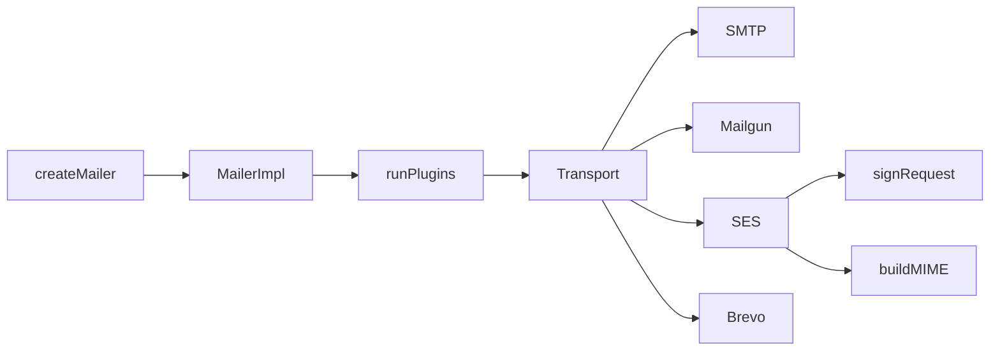

# sently v0.3 — Plugins, TLS minVersion, Mailgun, SES, Brevo

## Baseline

- **Version:** [package.json](package.json) is `0.2.1`; bump to `0.3.0` in Unit 7
- **Tests:** 97 passing across 11 test files (verified via `test(` counts)
- **Patterns to follow:**
  - HTTP transports: [src/transports/resend.ts](src/transports/resend.ts), [src/transports/sendgrid.ts](src/transports/sendgrid.ts)
  - Fetch mocking: [tests/transports/http.test.ts](tests/transports/http.test.ts) (`installFetchMock`, save/restore `globalThis.fetch`)
  - MIME for raw SES: [src/core/mime.ts](src/core/mime.ts) `buildMIME()` (async, no DKIM for SES)
  - Address helpers: [src/core/address.ts](src/core/address.ts) — Brevo mirrors SendGrid's `{ email, name? }` mapping



---

## Unit 1 — Types v0.3 + TLS minVersion

**Goal:** Extend types only; wire `minVersion` into Node/Bun TLS paths.

### [src/core/types.ts](src/core/types.ts)

Append after existing v0.2 interfaces:

| Addition | Details |
|----------|---------|
| `MailPlugin` | Sync or async `(options) => MailOptions` transformer |
| `TLSOptions.minVersion` | `'TLSv1' \| 'TLSv1.1' \| 'TLSv1.2' \| 'TLSv1.3'` |
| `SMTPConfig.plugins?` | `MailPlugin[]` |
| `CreateMailerOptions` | Transport variant gains explicit `plugins?: MailPlugin[]` (SMTP path inherits via `SMTPConfig.plugins`) |
| `MailgunConfig` | `apiKey`, `domain`, optional `region: 'us' \| 'eu'` |
| `SESConfig` | `accessKeyId`, `secretAccessKey`, optional `region`, `sessionToken` |
| `BrevoConfig` | `apiKey` |

Match existing file style (semicolons, section comment headers).

### [src/adapters/node.ts](src/adapters/node.ts) + [src/adapters/bun.ts](src/adapters/bun.ts)

Pass `minVersion` in **both** TLS code paths (user confirmed):

- `startTLS()` — `tls.connect({ ..., minVersion: merged.minVersion })`
- `connectTls()` — `tls.connect({ ..., minVersion: this.tlsOptions.minVersion })`

**Out of scope:** Deno/CF adapters (no `minVersion` support in their APIs today).

### Verify

```bash
bun run typecheck && bun run lint && bun test   # still 97 tests
```

---

## Unit 2 — Plugin System

**Goal:** Run plugins at `MailerImpl` level before transport `send()`.

### New: [src/core/plugin.ts](src/core/plugin.ts)

- Export `runPlugins(options, plugins?)` — sequential async pipeline; no-op when empty/undefined
- Do **not** export from [src/index.ts](src/index.ts) until Unit 7 (and per spec, never export `runPlugins` publicly)

### [src/detect.ts](src/detect.ts)

Update `MailerImpl`:

```ts
constructor(
  private readonly transport: Transport,
  private readonly plugins: MailPlugin[] = [],
) {}

async send(options: MailOptions): Promise<SendResult> {
  const processed = await runPlugins(options, this.plugins);
  return this.transport.send(processed);
}
```

Wire `plugins` in all three `createMailer` paths:

| Path | Plugins source | Transport construction |
|------|----------------|------------------------|
| Custom transport | `options.plugins ?? []` | `new MailerImpl(options.transport, plugins)` |
| SMTP pool | `smtpConfig.plugins` | Preserve existing `SMTPPool` + `createAdapter` callback |
| SMTP single | `smtpConfig.plugins` | Preserve existing `SMTPTransport({ ...smtpConfig, adapter })` |

**Also fix TLS passthrough** (user confirmed, while touching `detect.ts`):

- Extend `createDefaultAdapter` options with `tls?: TLSOptions`
- Pass `tls: smtpConfig.tls` in both pool `createAdapter` and single-adapter paths so `minVersion` works on port 465

Import `MailPlugin` and `runPlugins` in `detect.ts`.

### New: [tests/core/plugin.test.ts](tests/core/plugin.test.ts)

7 cases from spec: empty array, sync, async, ordering, HTML footer, subject change, immutability (original options unchanged after pipeline).

### Verify

```bash
bun test   # 97 + ~7 new
```

---

## Unit 3 — Mailgun Transport

**Goal:** First `multipart/form-data` transport (differs from JSON Resend/SendGrid/Postmark).

### New: [src/transports/mailgun.ts](src/transports/mailgun.ts)

| Concern | Implementation |
|---------|----------------|
| Endpoints | US: `https://api.mailgun.net/v3/{domain}/messages`; EU: `api.eu.mailgun.net` |
| Auth | `Authorization: Basic ${encodeBase64(`api:${apiKey}`)}` — strip `\r\n` from base64 like other transports |
| Body | Web `FormData` (not JSON) |
| Fields | `from`, `to` (comma-joined `toMIMEHeader`), optional `cc`/`bcc`, `subject`, `text`/`html`, `h:Reply-To`, repeated `attachment` blobs |
| Pipeline | `resolveAttachments()` first; `Uint8Array` → `Blob` with `contentType` |
| Success | HTTP 200 → `{ id, message }` |
| Error | `MailgunError(message, statusCode, apiError)` |
| SendResult | Per spec: `accepted` = `extractEmails(options.to)` only; `envelope.to` = to emails |

### New: [tests/transports/mailgun.test.ts](tests/transports/mailgun.test.ts)

Reuse `installFetchMock` pattern from [http.test.ts](tests/transports/http.test.ts). **FormData assertions:** read `init.body as FormData` and check `.get()` / iterate entries (not `JSON.parse`).

6 test cases from spec: Basic auth header, EU region URL, core form fields, BCC in form not headers, attachment blob, error on 4xx/5xx.

---

## Unit 4 — AWS SigV4 Utility

**Goal:** Internal signing module using Web Crypto only — no `node:crypto`, no AWS SDK.

> **Pre-implementation note (corrected from original spec):** `_date` must be a full AWS datetime, not `YYYYMMDD` alone. Apply this before writing `sigv4.ts`.

### New: [src/core/sigv4.ts](src/core/sigv4.ts)

Exports:

- `SigV4Credentials`, `SigV4Request`, `SigV4Result`
- `signRequest()` — full AWS4-HMAC-SHA256 pipeline per spec
- `hmacSHA256()`, `sha256Hex()` — exported with `@internal` TSDoc (used by tests)

**`SigV4Request._date` (corrected signature):**

```ts
/** Override datetime for testing. Full 'YYYYMMDDTHHMMSSZ' when provided. */
_date?: string
```

**Date derivation inside `signRequest()` (use exactly this):**

```ts
const amzDate = request._date
  ?? new Date().toISOString().replace(/[-:]/g, '').slice(0, 16) + 'Z'
const dateStamp = amzDate.slice(0, 8)
```

- Tests pass AWS official vectors' `amzDate` values directly via `_date` (e.g. `20150830T123600Z`) — no transformation
- Production uses real UTC datetime from `toISOString()`

Other implementation notes:

- Use `crypto.subtle.importKey` + `sign` for HMAC-SHA256
- Set `x-amz-date` header to `amzDate`
- Always sign lowercase headers: `content-type`, `host`, `x-amz-date`; add `x-amz-security-token` when `sessionToken` present
- Parse URL for canonical path + query

### New: [tests/core/sigv4.test.ts](tests/core/sigv4.test.ts)

5 cases from spec:

1. Empty SHA-256: `e3b0c44298fc1c149afbf4c8996fb92427ae41e4649b934ca495991b7852b855`
2. Known HMAC vector
3. Full `signRequest()` against [AWS SigV4 canonical request examples](https://docs.aws.amazon.com/general/latest/gr/sigv4-create-canonical-request.html) — pass full `_date` values from vectors (e.g. `20150830T123600Z`)
4. Authorization header format (`AWS4-HMAC-SHA256 Credential=...`)
5. `x-amz-security-token` when session token provided

---

## Unit 5 — AWS SES Transport

**Goal:** SES v2 HTTP API with SigV4 + optional raw MIME for attachments.

### New: [src/transports/ses.ts](src/transports/ses.ts)

| Concern | Implementation |
|---------|----------------|
| Endpoint | `POST https://email.{region}.amazonaws.com/v2/email/outbound-emails` (default `us-east-1`) |
| Auth | `signRequest({ service: 'ses', ... })` — merge signed headers into fetch |
| Simple body | No attachments → `Content.Simple` with Subject/Body Text+Html |
| Raw body | With attachments → `await buildMIME(resolvedOptions)` (no DKIM), base64-encode result → `Content.Raw.Data` |
| Addresses | `FromEmailAddress` via `toMIMEHeader`; `Destination.ToAddresses/CcAddresses/BccAddresses` via `extractEmails` |
| Success | HTTP 200 → `{ MessageId }` |
| Error | `SESError(message, statusCode, code, requestId)` — `requestId` from `x-amzn-requestid` header |
| SendResult | Per spec: `accepted` = to + cc + bcc emails; `envelope.to` = to only |

Import `encodeBase64` from [base64.ts](src/core/base64.ts) for raw MIME encoding.

### New: [tests/transports/ses.test.ts](tests/transports/ses.test.ts)

6 cases: region URL, SigV4 Authorization prefix, Simple JSON shape, Raw base64 with attachments, BCC in `Destination.BccAddresses`, `SESError` with request ID on 4xx.

Mock fetch; SES tests can assert SigV4 Authorization prefix + header presence (production uses live UTC; no `_date` needed in SES transport itself).

---

## Unit 6 — Brevo Transport

**Goal:** JSON API similar to SendGrid address mapping.

### New: [src/transports/brevo.ts](src/transports/brevo.ts)

| Concern | Implementation |
|---------|----------------|
| Endpoint | `POST https://api.brevo.com/v3/smtp/email` |
| Auth | Header `api-key: {apiKey}` |
| Body | JSON: `sender`, `to[]`, `cc[]`, `bcc[]`, `replyTo`, `subject`, `htmlContent`, `textContent`, `attachment[]` |
| Addresses | Mirror [sendgrid.ts](src/transports/sendgrid.ts): `parseAddresses` → `{ email, name? }` |
| Attachments | `{ name, content: encodeBase64(...).replace(/\r\n/g, "") }` |
| Success | HTTP **201** (not 200) → `{ messageId }` |
| Error | `BrevoError(message, statusCode, code)` from response body |

### New: [tests/transports/brevo.test.ts](tests/transports/brevo.test.ts)

7 cases from spec including 201-as-success.

---

## Unit 7 — Version, Exports, Docs

### [build.ts](build.ts)

Add entrypoints:

```ts
'src/transports/mailgun.ts',
'src/transports/ses.ts',
'src/transports/brevo.ts',
```

### [package.json](package.json) + [jsr.json](jsr.json)

- Version → `0.3.0`
- Add subpath exports for `./transports/mailgun`, `./transports/ses`, `./transports/brevo` (npm → `dist/`, JSR → `src/`)

### [src/index.ts](src/index.ts)

Add v0.3 exports (transports re-exported from root barrel — new vs v0.2 where HTTP transports were subpath-only):

```ts
export type { MailPlugin, MailgunConfig, SESConfig, BrevoConfig } from './core/types.js'
export { MailgunTransport, MailgunError } from './transports/mailgun.js'
export { SESTransport, SESError } from './transports/ses.js'
export { BrevoTransport, BrevoError } from './transports/brevo.js'
```

Do **not** export `runPlugins` or `sigv4` functions.

Also add `MailPlugin` to the existing type export block if keeping both patterns.

### [CHANGELOG.md](CHANGELOG.md)

Add `## [0.3.0]` entry per spec (plugins, three transports, TLS minVersion, parity milestone).

### [README.md](README.md)

Add sections: Plugin system, Mailgun, AWS SES (note Raw MIME for attachments), Brevo. Update "Why sently" transport list; remove stale "CRAM-MD5 planned" text.

### [PROGRESS.md](PROGRESS.md)

Append Unit 1–7 completion blocks after each unit (template from spec).

### Final verify

```bash
bun test              # expect ~125+ (97 + ~7 plugin + ~5 sigv4 + ~6 mailgun + ~6 ses + ~7 brevo)
bun run typecheck
bun run lint
bun run build         # dist/ includes new entrypoints
bun run publish:jsr-d # or npx jsr publish --dry-run
```

---

## Cross-cutting constraints

| Rule | Enforcement |
|------|-------------|
| No `node:crypto` in `src/core/` or `src/transports/` | Grep after each unit |
| No `import *` in `src/` | Biome + grep |
| Explicit return types on exported functions | Typecheck |
| Web Crypto only in core | `sigv4.ts` uses `crypto.subtle` |
| `fetch` + `FormData` only for HTTP transports | No `node:https` |
| Match semicolon/style of existing files | Biome check |
| Only unit OUTPUT files touched per unit | Strict scope |

---

## Key deviations from written spec (user-approved)

1. **Unit 1:** Also pass `minVersion` in `connectTls()` (not just `startTLS`) so SMTPS/port 465 respects legacy TLS floors
2. **Unit 2:** Pass `tls: smtpConfig.tls` into `createDefaultAdapter()` so `TLSOptions` (including `minVersion`) apply on implicit TLS connections
3. **Unit 4:** `_date` is full `YYYYMMDDTHHMMSSZ` (not `YYYYMMDD` + `T000000Z`). Derive `amzDate` / `dateStamp` as:
   ```ts
   const amzDate = request._date ?? new Date().toISOString().replace(/[-:]/g, '').slice(0, 16) + 'Z'
   const dateStamp = amzDate.slice(0, 8)
   ```
   Required for AWS official test vectors to work without transformation.

---

## Estimated test growth

| Unit | New tests |
|------|-----------|
| Unit 2 plugin | ~7 |
| Unit 3 mailgun | ~6 |
| Unit 4 sigv4 | ~5 |
| Unit 5 ses | ~6 |
| Unit 6 brevo | ~7 |
| **Total** | **~97 → ~128**
