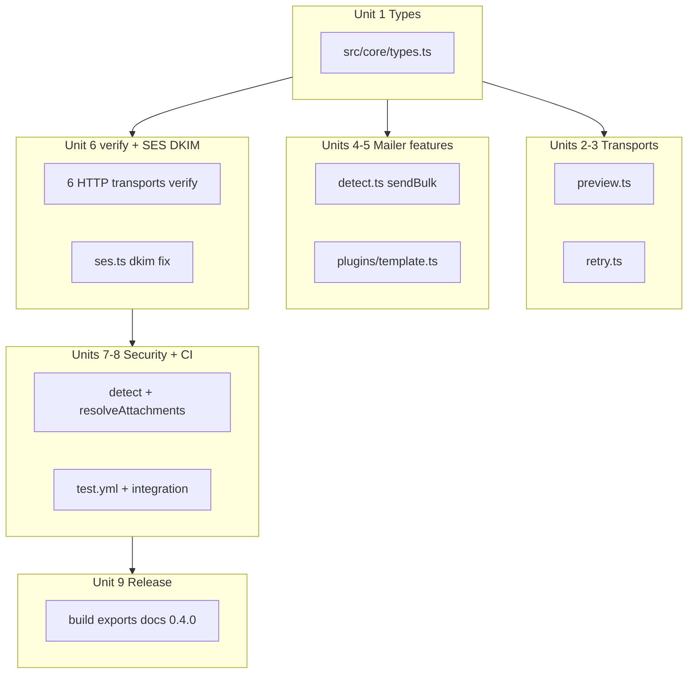

# sently v0.4 Implementation Plan

## Current baseline


| Item              | State                                                                                                                                                                                                |
| ----------------- | ---------------------------------------------------------------------------------------------------------------------------------------------------------------------------------------------------- |
| Version           | **0.3.4** in `[package.json](package.json)` / `[jsr.json](jsr.json)`                                                                                                                                 |
| Tests             | **129 passing** across 16 files                                                                                                                                                                      |
| `detectRuntime()` | Already correct: `bun → deno → cf-workers → browser → node → unknown` (`[src/detect.ts:19-35](src/detect.ts)`)                                                                                       |
| `verify()`        | Returns `Promise<boolean>` on `[Transport](src/core/types.ts)`, `[Mailer](src/core/types.ts)`, SMTP only (`[src/transports/smtp.ts:83](src/transports/smtp.ts)`); HTTP transports have no `verify()` |
| SES DKIM gap      | `[src/transports/ses.ts:78](src/transports/ses.ts)` calls `buildMIME(resolvedOptions)` without `dkim`; `SESConfig` has no `dkim` field                                                               |
| v0.4 targets      | All missing: `preview.ts`, `retry.ts`, `plugins/template.ts`, `sendBulk`, integration tests, dedicated CI workflow                                                                                   |





---

## Breaking change: `verify()` return type

Unit 1 changes `Transport.verify?()` from `Promise<boolean>` to `Promise<VerifyResult>`. This cascades to:

- `[Mailer.verify()](src/core/types.ts)` — update to `Promise<VerifyResult>` (MailerImpl delegates directly)
- `[MailerImpl.verify()](src/detect.ts)` — return `{ ok: true, provider: 'mailer' }` when transport has no `verify`
- `[SMTPTransport.verify()](src/transports/smtp.ts)` — wrap in try/catch; success → `{ ok: true, provider: 'smtp' }`, failure → `{ ok: false, provider: 'smtp', message }` (currently throws)
- `[SMTPPool.verify()](src/pool/pool.ts)` — same pattern with `provider: 'smtp-pool'`
- `[tests/transports/smtp.test.ts](tests/transports/smtp.test.ts)` — assert `VerifyResult` shape (`.ok`, `.provider`)
- `[tools/mcp/tools/check-smtp.ts](tools/mcp/tools/check-smtp.ts)` — updated in **Unit 6** (see below); not covered by `bun test`, only `bun run typecheck`

---

## Pre-implementation notes

### NOTE 1 — RetryTransport sleep injection (Unit 3)

Do **not** mock `globalThis.setTimeout` for backoff tests — brittle across runtimes.

Add an optional `_sleep` parameter to `RetryTransport` constructor (internal test hook, prefix `_` signals non-public API):

```ts
constructor(
  inner: Transport,
  config?: RetryConfig,
  private readonly _sleep: (ms: number) => Promise<void> = (ms) =>
    new Promise(resolve => setTimeout(resolve, ms)),
) {}
```

In tests, pass zero-delay sleep for deterministic fast backoff tests:

```ts
const transport = new RetryTransport(mockInner, config, () => Promise.resolve())
```

Do not export `_sleep` — constructor param only.

### NOTE 2 — MCP check-smtp.ts (Unit 6)

`[tools/mcp/tools/check-smtp.ts](tools/mcp/tools/check-smtp.ts)` calls `await transport.verify()` and relies on throw-vs-success. After Unit 1, `verify()` returns `Promise<VerifyResult>`; after Unit 6, SMTP `verify()` no longer throws on failure.

**Unit 6 OUTPUT must include this file.** Replace throw-based flow with:

```ts
const result = await transport.verify()
if (result.ok) {
  return { connected: true, ... }
}
return { connected: false, ..., error: result.message ?? 'Verification failed' }
```

This file is outside `tests/` — **always run `bun run typecheck` after Unit 6** (not optional).

---

## Unit 1 — Core Types v0.4

**File:** `[src/core/types.ts](src/core/types.ts)` — append only for existing interfaces.

Add to `MailOptions`:

- `template?: string`
- `data?: Record<string, unknown>`

Add new interfaces: `BulkSendOptions`, `BulkSendResult`, `RetryConfig`, `PreviewConfig`, `VerifyResult`.

Add to `Mailer`:

```ts
sendBulk(messages: MailOptions[], options?: BulkSendOptions): Promise<BulkSendResult>
```

Update `Transport.verify?()` → `Promise<VerifyResult>` and `Mailer.verify()` → `Promise<VerifyResult>`.

**Verify:** `bun run typecheck && bun test` (129 still pass — types only).

---

## Unit 2 — PreviewTransport

**Create:** `[src/transports/preview.ts](src/transports/preview.ts)`

Reuse existing helpers:

- `[resolveAttachments()](src/transports/resolve-attachments.ts)`
- `[buildMIME()](src/core/mime.ts)` → `mime.raw`, `mime.messageId`, `mime.envelope`
- `[extractEmails()](src/core/address.js)` for `SendResult.accepted`

Implementation notes:

- Default `outDir: './.emails'`, `format: 'eml'`, `open: false`
- Filename: `{Date.now()}-{sanitizedSubject}.{format}` (non-alphanumeric → `-`, max 40 chars)
- Dynamic imports only: `node:fs/promises` (mkdir + writeFile), `node:child_process` (spawn for open)
- Platform open: `darwin → open`, `linux → xdg-open`, `win32 → start`
- `verify()` → `{ ok: true, provider: 'preview' }`

**Create:** `[tests/transports/preview.test.ts](tests/transports/preview.test.ts)` (~6 tests)

Mock `fs/promises` via `mock.module` or spy on dynamic import; mock `child_process.spawn` for open tests.

---

## Unit 3 — RetryTransport

**Create:** `[src/transports/retry.ts](src/transports/retry.ts)`

Pure decorator — no `node:` imports. Backoff delays via injectable `_sleep` constructor param (see NOTE 1):

```ts
constructor(
  inner: Transport,
  config?: RetryConfig,
  private readonly _sleep: (ms: number) => Promise<void> = (ms) =>
    new Promise(resolve => setTimeout(resolve, ms)),
) {}
```

Use `this._sleep(delay)` inside retry loop — default implementation uses `setTimeout`.

`shouldRetry()` logic:

- HTTP errors with `statusCode` → check against `retryOn` (default `[429, 500, 502, 503, 504]`)
- `SMTPError` with `code === 535` → never retry (uses numeric `code` from `[SMTPError](src/core/smtp.ts)`)
- Other errors (network, SMTP without 535) → retry

`verify()` delegates to `inner.verify?.()` or `{ ok: true, provider: 'retry' }`.

**Create:** `[tests/transports/retry.test.ts](tests/transports/retry.test.ts)` (~7 tests)

Use mock inner transport. Pass `_sleep: () => Promise.resolve()` for zero-delay backoff tests — do **not** mock `globalThis.setTimeout`.

---

## Unit 4 — sendBulk()

**Modify:** `[src/detect.ts](src/detect.ts)` — add `sendBulk()` to `MailerImpl`

Algorithm per spec: concurrency queue with `options.concurrency ?? 1`, never throws, preserves input order, `onSuccess`/`onError` callbacks.

Import `BulkSendOptions`, `BulkSendResult` from types.

**Create:** `[tests/core/bulk.test.ts](tests/core/bulk.test.ts)` (~6 tests)

Use a mock `Transport` wrapped in `MailerImpl` (or `createMailer({ transport })`) to control send delays/failures.

---

## Unit 5 — TemplatePlugin

**Create:** `[src/plugins/template.ts](src/plugins/template.ts)`

Exports: `TemplateEngine`, `TemplatePluginConfig`, `simpleEngine`, `templatePlugin`.

Regex: `/\{\{(\w+)\}\}/g` — unknown vars → `''`.

Plugin strips `template` and `data` via destructuring before returning.

**Create:** `[tests/plugins/template.test.ts](tests/plugins/template.test.ts)` (~8 tests)

No `node:` static imports in `src/plugins/`.

---

## Unit 6 — verify() for HTTP transports + SES DKIM

### HTTP verify() (6 transports)

Each returns `VerifyResult`, never throws. Pattern:

```ts
async verify(): Promise<VerifyResult> {
  try {
    const res = await fetch(/* provider-specific GET */);
    if (!res.ok) return { ok: false, provider: '...', message: `HTTP ${res.status}` };
    // parse JSON for message field where applicable
    return { ok: true, provider: '...', message: '...' };
  } catch (err) {
    return { ok: false, provider: '...', message: err instanceof Error ? err.message : String(err) };
  }
}
```


| Transport | Endpoint                                   | Success message           |
| --------- | ------------------------------------------ | ------------------------- |
| Resend    | `GET /domains`                             | `'API key is valid'`      |
| SendGrid  | `GET /v3/user/profile`                     | `response.username`       |
| Postmark  | `GET /server`                              | `response.Name`           |
| Mailgun   | `GET /v3/domains` (US/EU)                  | `'API key is valid'`      |
| SES       | `GET /v2/email/configuration-sets` (SigV4) | `'Credentials are valid'` |
| Brevo     | `GET /v3/account`                          | `response.companyName`    |


Reuse existing auth patterns from each transport's `send()` (Bearer, Basic, api-key header, SigV4 via `[signRequest](src/core/sigv4.js)`).

### SES DKIM fix

In `[src/core/types.ts](src/core/types.ts)`: add `dkim?: DKIMConfig` to `SESConfig`.

In `[src/transports/ses.ts](src/transports/ses.ts)`:

- Store `this.dkim = config.dkim` in constructor
- Line 78: `buildMIME(resolvedOptions, this.dkim)`

Note: DKIM only applies on Raw MIME path (attachments). Simple path unchanged — document in CHANGELOG.

### Tests (~12 verify tests)

- `[tests/transports/http.test.ts](tests/transports/http.test.ts)`: +2 each for Resend, SendGrid, Postmark (success + failure, never throws)
- `[tests/transports/mailgun.test.ts](tests/transports/mailgun.test.ts)`: +2
- `[tests/transports/brevo.test.ts](tests/transports/brevo.test.ts)`: +2
- `[tests/transports/ses.test.ts](tests/transports/ses.test.ts)`: +2 (+ optional DKIM raw-path test)

Also update SMTP/pool verify tests for `VerifyResult` shape.

### MCP tool fix (NOTE 2)

**Modify:** `[tools/mcp/tools/check-smtp.ts](tools/mcp/tools/check-smtp.ts)`

Current code awaits `transport.verify()` inside try/catch assuming throw-on-failure. After SMTP `verify()` returns `VerifyResult` without throwing, check `result.ok` explicitly and surface `result.message` on failure.

**Unit 6 verify gate:** `bun test && bun run typecheck && bun run lint` — typecheck is required to catch MCP breakage.

---

## Unit 7 — Deferred security fixes

### Task A — detectRuntime (likely no-op)

Priority order in `[src/detect.ts:19-35](src/detect.ts)` already matches spec. CF Workers uses positive signature (`caches` + UA). **Report "confirmed correct"** in PROGRESS.md unless review finds edge case.

### Task B — basePath guard

**Modify:** `[src/transports/resolve-attachments.ts](src/transports/resolve-attachments.ts)`

```ts
export interface ResolveAttachmentsOptions {
  basePath?: string
}
export async function resolveAttachments(
  attachments: Attachment[] | undefined,
  options?: ResolveAttachmentsOptions,
): Promise<Attachment[]>
```

When `basePath` set: dynamic `import('node:path')`, `resolve()` both paths, prefix check with clear error message. Do **not** wire `basePath` from any transport call site.

**Create:** `[tests/transports/resolve-attachments.test.ts](tests/transports/resolve-attachments.test.ts)` (~4 tests)

Symlink escape test: create temp dir + symlink via `fs.symlink` in test setup (Node/Bun only).

Update existing callers: pass `attachments` only (second arg omitted) — signature change is backward compatible if default `attachments = []` preserved.

---

## Unit 8 — CI + Integration tests

### GitHub Actions

**Create:** `[.github/workflows/test.yml](.github/workflows/test.yml)` per spec with 3 jobs:

1. `test-bun` — install, test, typecheck, lint
2. `test-node` — build + Node 22 smoke import of `dist/index.js`
3. `test-integration` — Mailpit service on ports 1025/8025

Note: `[publish.yml](.github/workflows/publish.yml)` already runs test+lint on PR/push — `test.yml` adds Node smoke + Mailpit integration without modifying publish workflow (per spec boundary). Some duplication on Bun unit tests is acceptable.

### Integration test

**Create:** `[tests/integration/smtp.integration.ts](tests/integration/smtp.integration.ts)`

Standalone script (not `*.test.ts`) — excluded from `bun test` glob automatically. Run via `bun run tests/integration/smtp.integration.ts`.

Uses `createMailer` from `sently`, Mailpit REST API at `localhost:8025/api/v1/messages`.

Optional: add `"test:integration"` script to `package.json` for convenience (not in spec OUTPUT — skip unless useful).

### MIME edge cases

**Append to:** `[tests/core/mime.test.ts](tests/core/mime.test.ts)` (~4 tests):

1. Emoji-only subject → RFC 2047 encoded
2. 50 recipients in `to` → all in `envelope.to`
3. HTML with literal `\r\n` → valid MIME boundaries
4. Zero-byte attachment → valid base64, `Content-Length: 0`

---

## Unit 9 — Version + Exports + Docs

### build.ts

Add entrypoints:

```ts
'src/transports/preview.ts',
'src/transports/retry.ts',
'src/plugins/template.ts',
```

### package.json + jsr.json

- Version → `"0.4.0"`
- New subpath exports: `./transports/preview`, `./transports/retry`, `./plugins/template`

### src/index.ts

Export types (`BulkSendOptions`, `BulkSendResult`, `RetryConfig`, `PreviewConfig`, `VerifyResult`) and implementations (`PreviewTransport`, `RetryTransport`, `templatePlugin`, `simpleEngine`, template types).

Do **not** export `resolveAttachments`, `runPlugins`, sigv4 internals.

### CHANGELOG.md + README.md

Add `[0.4.0]` section and four new README sections (Preview, Retry, sendBulk, TemplatePlugin) after existing transports section.

### PROGRESS.md

Append v0.4 unit entries after each unit completes (per spec template).

### Final verify

```bash
bun test                    # ~176 tests
bun run typecheck
bun run lint
bun run build
bun run publish:jsr-d      # 0 slow-type warnings
```

---

## Estimated test growth


| Unit                 | New tests | Running total |
| -------------------- | --------- | ------------- |
| Start                | —         | 129           |
| Unit 2 Preview       | ~6        | ~135          |
| Unit 3 Retry         | ~7        | ~142          |
| Unit 4 sendBulk      | ~6        | ~148          |
| Unit 5 Template      | ~8        | ~156          |
| Unit 6 verify + SMTP | ~14       | ~170          |
| Unit 7 basePath      | ~4        | ~174          |
| Unit 8 MIME edge     | ~4        | ~178          |


Integration test is standalone (not counted in `bun test`).

---

## Constraints checklist (every unit)

- Bun only for scripts/tests
- No `node:` static imports in `src/core/` or `src/plugins/`
- No `import *` in `src/`
- Explicit return types on all exports
- Only OUTPUT files modified per unit
- `src/index.ts` re-exports only — no logic
- Web Crypto only in core; zero deps in core

---

## Execution order

Strict dependency chain from spec — do not skip ahead:

1. Types → 2. Preview → 3. Retry → 4. sendBulk → 5. Template → 6. verify+SES → 7. Security → 8. CI+Integration → 9. Release

After each unit: `bun test && bun run typecheck && bun run lint`, then append PROGRESS.md entry.